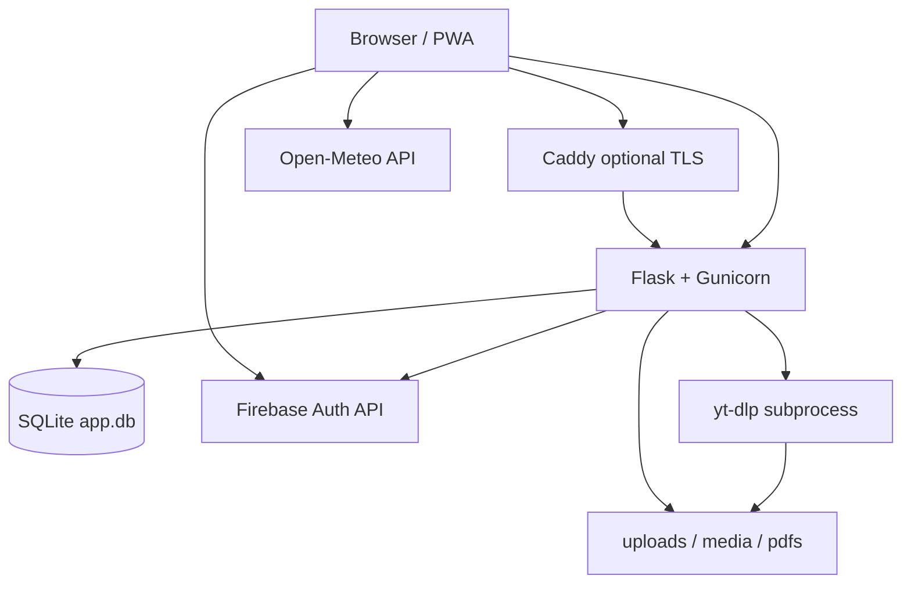

# Architecture

## Tech stack

| Layer | Technology | Notes |
|-------|------------|--------|
| Language | Python 3.12 | Alpine in Docker |
| Web framework | Flask | App factory: `app/create_app()` |
| ORM | Flask-SQLAlchemy | SQLite file `data/app.db` |
| Templates | Jinja2 | `templates/`; theme CSS vars from `config.yml` |
| Frontend CSS | Tailwind CSS 3.x | `static/input.css` → `static/output.css` via npm |
| Client JS | Vanilla JS | `static/js/` (reminders, weather, tags, Firebase auth) |
| HTTP server (prod) | Gunicorn | 1 worker, sync worker class (`Dockerfile`) |
| Dev server | Flask built-in | `run.py`, `debug=True` |
| Media download | yt-dlp | Subprocess in background thread (`media_pdfs.py`) |
| PDF | Ghostscript | Runtime Alpine package |
| Video/audio | ffmpeg | Runtime Alpine package |
| QR | `qrcode` + Pillow | |
| Sanitization | bleach | `app/security.py` |
| Rate limiting | Flask-Limiter | In-memory store; per-route overrides |
| Auth (optional) | firebase-admin | ID token verify; session cookie server-side |
| Encryption (QR) | cryptography (Fernet) | Key derived from `SECRET_KEY` |
| Config | PyYAML | `config.yml` required at repo root |
| PWA | Service worker | Generated at `/sw.js` in `blueprints/__init__.py` |
| Container | Docker multi-stage | Node build for CSS in builder stage |
| Edge (optional) | Caddy | `compose.prod.with-caddy.yml`, `deploy/Caddyfile*` |

## System design pattern

**Modular monolith** — single process, single SQLite database, one Flask blueprint (`main_bp`) preserving flat URL paths.

- **Not** microservices.
- **MVC-ish:** routes in `app/blueprints/*`, models in `app/models.py`, views in `templates/`.
- **Cross-cutting:** `before_app_request` auth gate (`auth.py`), `user_context.py` for identity, `security.py` for sanitization/SSRF.
- **Async work:** daemon `threading.Thread` for yt-dlp downloads only (not a job queue).

## High-level diagram

## Data flow

### Configuration (read on nearly every request)

1. `config.yml` on disk → `load_config()` / `apply_config_defaults()` (`app/config.py`).
2. Plaintext `password` hashed to `password_hash` at load time (SHA-256); never stored in YAML after load.
3. `auth.before_app_request` reloads config each request (except `TESTING`) so hot edits work without restart.

### Typical write (HTML form)

1. User submits form (often with `creator` field in **legacy** mode).
2. `resolve_actor()` / `resolve_user()` (`user_context.py`): Firebase mode **ignores** client `creator` and uses session display name.
3. `sanitize_text()` / `sanitize_html()` on inputs.
4. `can_modify_record()` on edits/deletes (admin or owner).
5. SQLAlchemy `db.session` commit → SQLite.
6. Redirect + flash, or JSON for `/api/*`.

### Typical read (dashboard)

1. `GET /` → `dashboard.index` loads Notice, Reminder aggregates, HomeStatus, MemberStatus, optional home chores.
2. Template receives `config` (feature toggles), serialized reminder JSON for calendar JS.

### Reminders / calendar API

1. Client: `static/js/reminders_api.js` + bootstrap JSON on `index.html`.
2. REST: `/api/reminders`, `/api/recurring_rules/<id>` (`dashboard.py`).
3. Recurring rules materialize into `Reminder` rows via generation logic in dashboard (see tests in `test_recurring_reminders.py`).

### Media download

1. `POST /media` → validate URL (`media_guard.is_media_url_allowed`, SSRF check in `security.is_url_safe_for_fetch`).
2. Insert `Media` row `status=pending`; spawn thread running yt-dlp.
3. Poll `GET /media/status/<id>`; files land under `media/`; serve via `/media/<filename>` with basename checks.

### Authentication flows

**Legacy**

- Optional `password_hash` in config → session `authed=True` after `POST /login`.
- No password → all routes open (LAN trust model).

**Firebase**

- Client loads `/auth/config`, signs in with Google (Firebase JS SDK in `static/js/firebase-auth.js`).
- `POST /auth/session` with `idToken` → Admin SDK verify → allowlist check → session keys: `firebase_uid`, `firebase_email`, `display_name`.

### Files (non-DB)

| Path | Purpose |
|------|---------|
| `uploads/` | Shared cloud files |
| `media/` | Downloaded media |
| `pdfs/` | Uploaded/compressed PDFs |
| `data/app.db` | SQLite |
| `data/firebase-service-account.json` | Fallback credentials mount |

## External dependencies & APIs

| Service | Used by | Data sent |
|---------|---------|-----------|
| **Open-Meteo** | `GET /api/weather` + `static/js/weather.js` | Lat/lon, timezone (browser or config) |
| **Firebase Auth** | Login page, `/auth/session` | Google ID token; server uses service account JSON |
| **Google Calendar API** | `app/google_calendar/*`, `/auth/google/calendar/*`, `/api/calendar/*` | OAuth refresh tokens (encrypted); import-first sync with optional bidirectional opt-in |
| **Google Fonts / Font Awesome CDN** | `templates/base.html` | Browser loads assets from CDNs |
| **YouTube/Vimeo/etc.** | yt-dlp | Video URLs (operator-controlled allowlist) |

Notes/shopping/etc. remain local-only; calendar supports Google import with default `import_only` mode and optional bidirectional sync mode.

## Security architecture (production-oriented)

- **Session cookies:** signed with `SECRET_KEY`; `HttpOnly`, `SameSite=Lax`, `Secure` when behind proxy.
- **ProxyFix** when `TRUST_PROXY=1` (default in prod compose).
- **Response headers:** `X-Content-Type-Options`, `X-Frame-Options`, `Referrer-Policy`, optional HSTS.
- **CSRF:** `WTF_CSRF_ENABLED = False` globally (rely on SameSite + auth gate; know this if adding forms).
- **Hardening block** in `config.yml`: media domain allowlist, QR payload encryption, WiFi history policies (`hardening` in `config.py` defaults).

## Deployment topologies

1. **Dev / LAN:** `compose.yml` or `python run.py`, port 5000, optional empty password.
2. **Prod behind existing Caddy:** `compose.prod.yml` binds `127.0.0.1:5000`, joins external Docker network `PROXY_NETWORK`.
3. **Prod with bundled Caddy:** `compose.prod.with-caddy.yml` + `deploy/Caddyfile`.

## CI/CD (actual behavior)

- Workflow: `.github/workflows/docker-publish.yml`
- Triggers: git tags `v*`, `workflow_dispatch`
- Steps: `npm run build:css` → multi-arch Docker push to `ghcr.io/<owner>/homehub`
- **Does not run pytest** in CI
